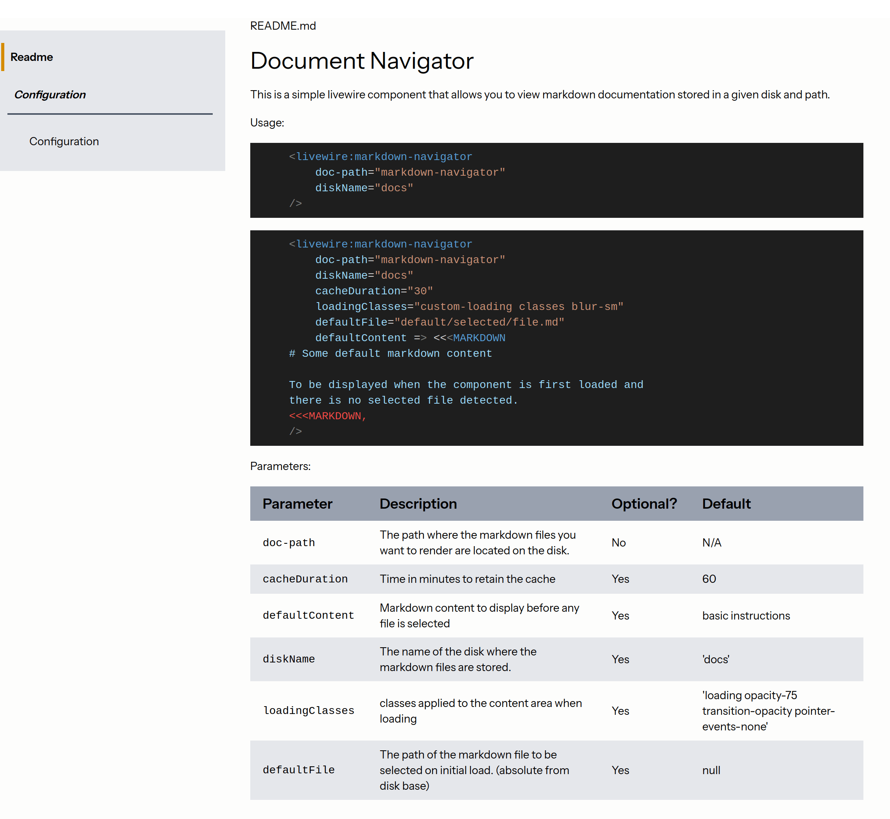
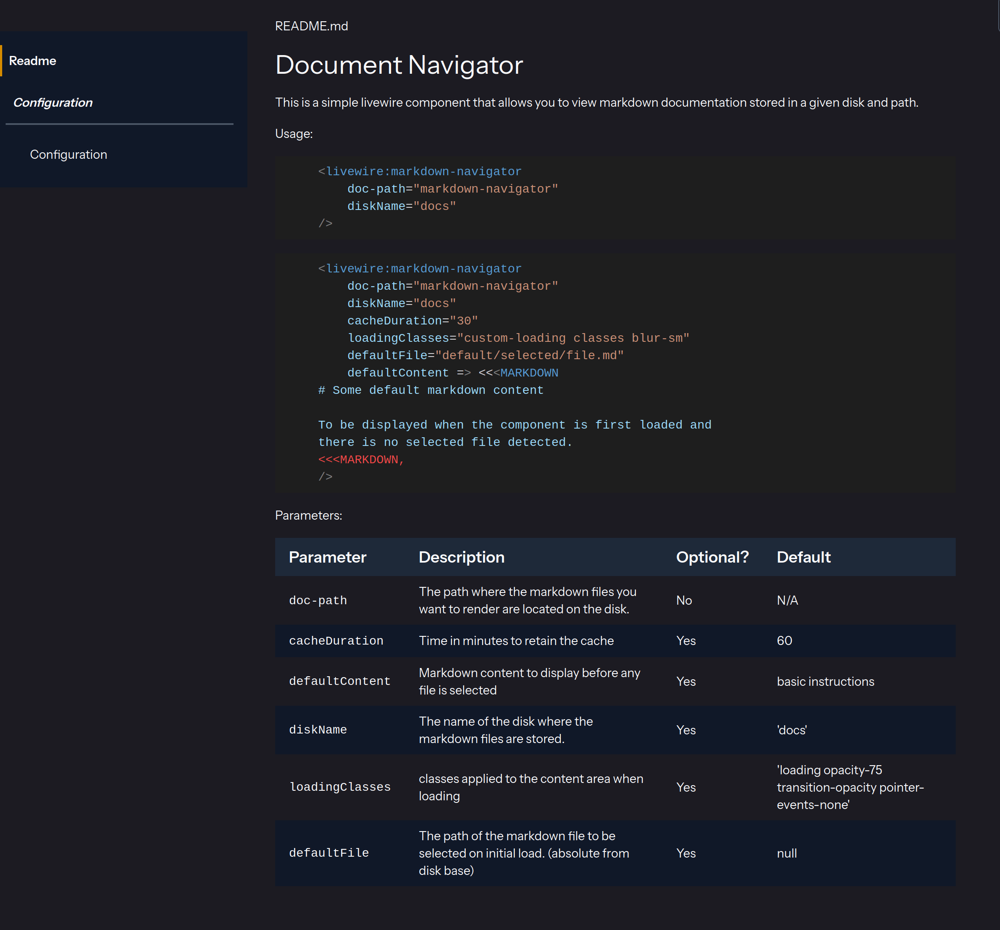

# Render a directory of markdown files in a livewire component

[](https://packagist.org/packages/perturbatio/livewire-markdown-navigator)
[](https://github.com/perturbatio/livewire-markdown-navigator/actions?query=workflow%3Arun-tests+branch%3Amain)
[](https://github.com/perturbatio/livewire-markdown-navigator/actions?query=workflow%3A"Fix+PHP+code+style+issues"+branch%3Amain)
[](https://packagist.org/packages/perturbatio/livewire-markdown-navigator)

A livewire component that allows you to view markdown documentation stored in a given disk and path.




## Support Spatie's open source work

This package was NOT created by Spatie, but it was created using Spatie's [spatie/laravel-package-tools](https://github.com/spatie/laravel-package-tools),
without them, this package probably would have been possible, but I'm not sure I could have been as motivated to make it.
But I have used several of their other excellent packages.

They invest a lot of resources into creating [best in class open source packages](https://spatie.be/open-source). You can support them by [buying one of our paid products](https://spatie.be/open-source/support-us).

They highly appreciate you sending them a postcard from your hometown, mentioning which of their package(s) you are using (and maybe this one too). 
You'll find their address on [their contact page](https://spatie.be/about-us). They publish all received postcards on [their virtual postcard wall](https://spatie.be/open-source/postcards).

## Other support

If you can afford it, the people in Ukraine need help right now, and there are many organisations doing excellent work to provide humanitarian aid, medical supplies, and other support. Consider donating to one of these organisations:

* https://donate.redcross.org.uk/appeal/ukraine-crisis-appeal
* https://www.unicef.org.uk/donate/donate-now-to-protect-children-in-ukraine/
* https://donate.unrefugees.org.uk/ukraine-emergency/

There are many other efforts you can support also, including:

* https://gamersoutreach.org/ - Gamers Outreach is a charity that empowers hospitalized families through play.
* https://www.gosh.org/ - Great Ormond Street Hospital in London, UK

## Installation

You can install the package via composer:

```bash
composer require perturbatio/livewire-markdown-navigator
```

## Config
You can publish the config file with:

```bash
php artisan vendor:publish --tag="livewire-markdown-navigator-config"
```


This is the contents of the published config file:

```php
// config for Perturbatio\\LivewireMarkdownNavigator/LivewireMarkdownNavigator
return [
    'default_disk' => 'docs',
    'permitted_disks' => [
        'docs',
    ],
    'commonmark_options' => [

    ],
];

```

| Key                  | Description                                                                                                                                                                                            | Default Value |
|----------------------|--------------------------------------------------------------------------------------------------------------------------------------------------------------------------------------------------------|---------------|
| `default_disk`       | The default disk to use when no disk is specified. Must be included in the `permitted_disks` array.                                                                                                    | 'docs'        |
| `permitted_disks`    | An array of disk names that the component is allowed to access. This is a security measure to prevent unauthorized access to files on the server.                                                      | ['docs']      |
| `commonmark_options` | An array of options to pass to the CommonMark parser. This allows you to customize the markdown rendering. For example, you can enable or disable certain markdown features, or add custom extensions. | []            |

For more information on the available CommonMark options, see the [league/commonmark documentation](https://commonmark.thephpleague.com/2.x/configuration/).

## Livewire Component usage
See [component documentation](resources/docs/markdown-navigator/README.md).

## Styles
You can publish the assets (CSS) with:

```bash
php artisan vendor:publish --tag="livewire-markdown-navigator-assets"
```

A copy of the minified CSS AND the tailwind source file will be copied

You can include the minified CSS in your app, or import the tailwind source file into your tailwind config.

```css
@import 'path/to/public/vendor/livewire-markdown-navigator/markdown-navigator.tailwind.css';
```

The CSS relies on some colour definitions which are not included in the tailwind source, this is to allow you to define
these yourself or inherit them from something like Filament. The colour definitions are as follows:

```css
:root {
    --primary-50: oklch(98.5% 0.158 74.47);
    --primary-100: oklch(91.5% 0.158 74.47);
    --primary-200: oklch(84.5% 0.158 74.47);
    --primary-300: oklch(77.5% 0.158 74.47);
    --primary-400: oklch(69.5% 0.158 74.47);
    --primary-500: oklch(62.5% 0.158 74.47);
    --primary-600: oklch(55.5% 0.158 74.47);
    --primary-700: oklch(47.5% 0.158 74.47);
    --primary-800: oklch(40.5% 0.158 74.47);
    --primary-900: oklch(33.5% 0.158 74.47);
    --primary-950: oklch(25.5% 0.158 74.47);
    --gray-50: oklch(0.985 0.002 247.839);
    --gray-100: oklch(0.967 0.003 264.542);
    --gray-200: oklch(0.928 0.006 264.531);
    --gray-300: oklch(0.872 0.01 258.338);
    --gray-400: oklch(0.707 0.022 261.325);
    --gray-500: oklch(0.551 0.027 264.364);
    --gray-600: oklch(0.446 0.03 256.802);
    --gray-700: oklch(0.373 0.034 259.733);
    --gray-800: oklch(0.278 0.033 256.848);
    --gray-900: oklch(0.21 0.034 264.665);
    --gray-950: oklch(0.13 0.028 261.692);
    --color-gray-100: var(--gray-100);
    --color-gray-200: var(--gray-200);
    --color-gray-300: var(--gray-300);
    --color-gray-400: var(--gray-400);
    --color-gray-500: var(--gray-500);
    --color-gray-600: var(--gray-600);
    --color-gray-700: var(--gray-700);
    --color-gray-900: var(--gray-900);
    --color-gray-950: var(--gray-950);
    --color-black: #000;
    --color-white: #fff;
}
@utility border-primary-50 {
    border-color: var(--primary-50);
}
@utility border-primary-100 {
    border-color: var(--primary-100);
}
@utility border-primary-200 {
    border-color: var(--primary-200);
}
@utility border-primary-300 {
    border-color: var(--primary-300);
}
@utility border-primary-400 {
    border-color: var(--primary-400);
}
@utility border-primary-500 {
    border-color: var(--primary-500);
}
@utility border-primary-600 {
    border-color: var(--primary-600);
}
@utility border-primary-700 {
    border-color: var(--primary-700);
}
@utility border-primary-800 {
    border-color: var(--primary-800);
}
@utility border-primary-900 {
    border-color: var(--primary-900);
}
@utility border-primary-950 {
    border-color: var(--primary-950);
}
```

Optionally, you can publish the views using

```bash
php artisan vendor:publish --tag="livewire-markdown-navigator-views"
```

## Usage

Usage:
```blade
    <livewire:markdown-navigator
        doc-path="markdown-navigator"
        diskName="docs"
    />
```

```blade
    <livewire:markdown-navigator
        doc-path="markdown-navigator"
        diskName="docs"
        cacheDuration="30"
        loadingClasses="custom-loading classes blur-sm"
        defaultFile="default/selected/file.md"
        defaultContent => <<<MARKDOWN
    # Some default markdown content
    
    To be displayed when the component is first loaded and
    there is no selected file detected.
    <<<MARKDOWN,
    />
```

Parameters:

| Parameter        | Description                                                                             | Optional? | Default                                                     |
|------------------|-----------------------------------------------------------------------------------------|-----------|-------------------------------------------------------------|
| `doc-path`       | The path where the markdown files you<br/>want to render are located on the disk.       | No        | N/A                                                         |
| `cacheDuration`  | Time in minutes to retain the cache                                                     | Yes       | 60                                                          |
| `defaultContent` | Markdown content to display before any file is selected                                 | Yes       | basic instructions                                          |
| `diskName`       | The name of the disk where the markdown files are stored.                               | Yes       | 'docs'                                                      |
| `loadingClasses` | classes applied to the content area when loading                                        | Yes       | 'loading opacity-75 transition-opacity pointer-events-none' |
| `defaultFile`    | The path of the markdown file to be selected on initial load. (absolute from disk base) | Yes       | null                                                        |


## Testing

```bash
composer test
```

Code coverage:
```bash
composer test-coverage
```

Mutation testing:
```bash
composer test-mutations
```

Static analysis:
```bash
composer analyse
```

Code formatting:
```bash
composer format
```

You can run all of these at once with:

```bash
composer test-all
```

## Changelog

Please see [CHANGELOG](CHANGELOG.md) for more information on what has changed recently.

## Contributing

Please see [CONTRIBUTING](CONTRIBUTING.md) for details.

## Security Vulnerabilities

Please review [our security policy](../../security/policy) on how to report security vulnerabilities.

## Credits

- _[Kris Kelly_](https://github.com/Perturbatio)
- [All Contributors](../../contributors)

## License

The MIT License (MIT). Please see [License File](LICENSE.md) for more information.
